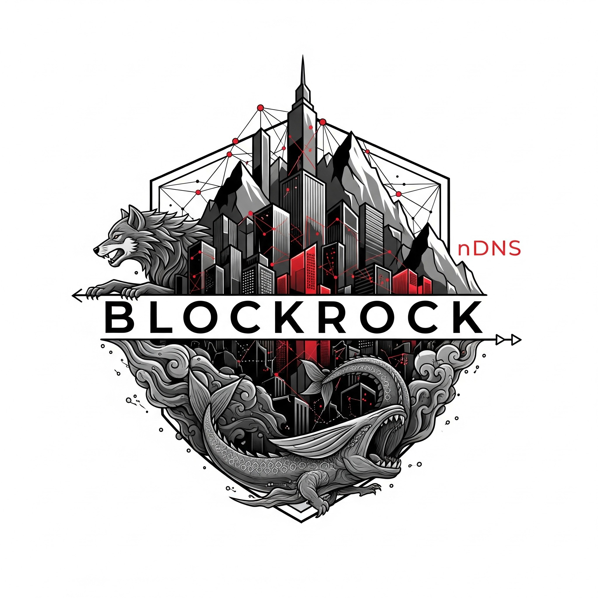

# BlockRock – Ecosistema Blockchain, IoT & AI

BlockRock è un ecosistema open-source che unisce blockchain P2P in Rust, IoT su smartphone, machine learning, dashboard web e gamification narrativa in un’architettura modulare chiamata Zion.  
Zion funge da orchestratore centrale, coordinando moduli come una coreografia digitale, mentre ogni modulo (blockchain, IoT, ML, dashboard) si aggiorna e si integra attraverso documentazione automatica e test regolari.

---

## 📁 Struttura del repository

```
BlockRock/
├── blockrock-core/ # Core blockchain in Rust (SHA-256, PoA)
├── zion-core/ # Orchestratore P2P, API REST/gRPC, Prometheus
├── nexus/ # Dashboard web Vue, dati real-time, avatar RPG
├── lifeforge/ # App Android gamificata (narrativa RPG)
├── iot/ # Nodi IoT (Samsung S9, GPS, sensori)
├── ml/ # Moduli Machine Learning (ClearML, EEG)
├── docs/ # Documentazione, immagini, guide
├── static/ # File statici per frontend
├── README.md # Questa guida!
├── CONTRIBUTING.md # Come contribuire
├── LICENSE.md # Licenza MIT
├── .gitignore
```

---

## 🚀 Cos’è BlockRock?

BlockRock è una piattaforma modulare dove ogni componente è indipendente ma interconnesso tramite Zion, l’orchestratore centrale.  
L’obiettivo è creare una sinergia tra blockchain, IoT, AI e narrativa RPG, per un’esperienza digitale unica e sostenibile.

- **Blockchain P2P in Rust:** Consenso PoA, REST/gRPC, integrazione Tron Nile Testnet.
- **Nodi IoT:** Smartphone Android come nodi per raccolta dati GPS e sensori.
- **Neoterra Nexus:** Dashboard Vue 3, avatar dinamico, widget real-time, ispirazione RPG.
- **LifeForge:** App Android gamificata, missioni narrative, raccolta dati.
- **Machine Learning:** Modelli ClearML, EEG, AI per automazione e analisi.
- **Zion Orchestrator:** Coordina moduli, genera documentazione, crea Issues GitHub, integra Prometheus.

---

## 📝 Build & Setup

### Prerequisiti

- [Rust 1.76+](https://rustup.rs/)
- [Node.js](https://nodejs.org/) (per Nexus)
- [Android NDK r26b](https://developer.android.com/ndk/downloads) (per LifeForge/IoT)
- **Chiave TronGrid (Nile Testnet):**  
  Ottieni la tua API key gratuita su [TronGrid](https://www.trongrid.io/)

### Setup rapido
```bash
git clone `https://github.com/BlockRockAdmin/BlockRock.git`  
cd `BlockRock`
```
**Compila il core blockchain:**  
```bash
cd `blockrock-core`  
cargo build
```
**Build e lancia zion-core (orchestratore):**  
```bash
cd `../zion-core`  
cargo build  
export `TRONGRIDAPIKEY=la_tua_api_key`  # Imposta la chiave TronGrid  
cargo run
```
**Avvia la dashboard Nexus:** 
```bash
cd `../nexus`  
npm install  
npm run dev
```
Apri [http://localhost:5173](http://localhost:5173) nel browser.

---

## 🛠️ Troubleshooting

- **NaN TRX nella dashboard:** verifica la variabile `TRONGRIDAPIKEY` e l’indirizzo Tron.
- **Errore “static non trovato” all’avvio:** crea la cartella `static/` dentro `zion-core` e inserisci `index.html`.
- **Errore di build su Rocket/libp2p:** assicurati di usare Rust 1.76+ e le versioni indicate in `Cargo.toml`.
- **Errori npm:** assicurati di avere Node.js 16+ e npm aggiornato.

---

## 📚 Documentazione & Wiki

- [Wiki BlockRock](https://github.com/BlockRockAdmin/BlockRock/wiki)
- [Architettura Tecnica](https://github.com/BlockRockAdmin/BlockRock/wiki/Architettura-Tecnica-%F0%9F%9B%A0%EF%B8%8F)
- [Roadmap](https://github.com/BlockRockAdmin/BlockRock/wiki#-roadmap)
- [Come contribuire](https://github.com/BlockRockAdmin/BlockRock/wiki/Come-contribuire-%E2%9A%A1)
- [Contatti & Community](https://github.com/BlockRockAdmin/BlockRock/wiki/Contatti-&-Community-%F0%9F%93%AC)

---

## 🌍 Visione e obiettivi futuri

- Unire blockchain, IoT e AI in un ecosistema modulare e sostenibile.
- Espandere la rete di nodi con smartphone, sensori solari e dispositivi low-cost.
- Integrare il token BRK su TRON e realizzare un bridge cross-chain.
- Automazione e gamification: ogni azione, dato o scelta diventa parte di una storia digitale condivisa.
- Aprire la governance: roadmap e sviluppo decisi insieme alla community.

---

## 🤝 Contribuire

BlockRock è guidato dalla community e **i contributi sono benvenuti**!

1. Fai un fork del repository.
2. Crea un branch descrittivo (es. `feature-miglioramenti-gps`).
3. Committa con messaggi chiari.
4. Apri una Pull Request.
5. Consulta il file [CONTRIBUTING.md](CONTRIBUTING.md) per dettagli.

---

## 📬 Contatti & Community

- [Wiki](https://github.com/BlockRockAdmin/BlockRock/wiki)
- [Architettura Tecnica](https://github.com/BlockRockAdmin/BlockRock/wiki/Architettura-Tecnica-%F0%9F%9B%A0%EF%B8%8F)
- [GitHub Issues](https://github.com/BlockRockAdmin/BlockRock/issues)
- [GitHub Sponsors](https://github.com/sponsors/BlockRockAdmin)
- [Telegram](https://web.telegram.org/k/#@blockrock_main)
- [Discord](https://discord.gg/Jrd2Tga5)

---

> **BlockRock: forgia il tuo destino nella blockchain sostenibile!**
>
> Ogni modulo è una pietra, ogni contributo una scintilla.

