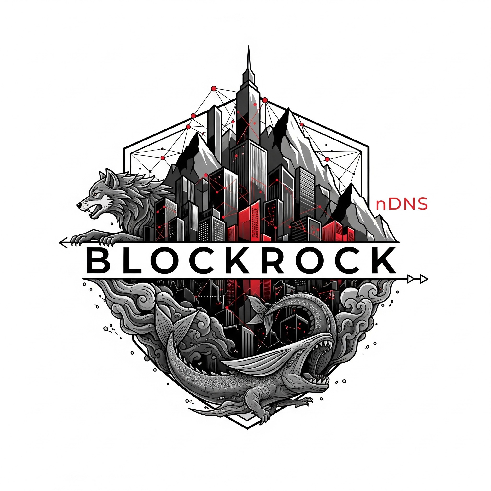

## 📁 Struttura del repository

```
BlockRock/
├── .github/
│   └── workflows/        # Workflow CI/CD automatizzati (build, test, deploy)
│       └── deploy.yml    # Esempio di workflow per il deploy automatico
├── blockrock-core/       # Modulo blockchain: nodo P2P, consenso PoA, storage decentralizzato
│   └── src/              # Codice sorgente Rust del nodo blockchain
│       └── ...           # Altri file e moduli interni
├── zion-core/            # Modulo orchestratore: API REST/gRPC, metriche, integrazione Tron
│   └── src/              # Codice sorgente Rust dell’orchestratore
│       └── ...           # Altri file e moduli interni
├── static/               # File statici per dashboard web e UI (HTML, JS, CSS)
│   └── index.html        # Home della dashboard web
├── docs/                 # Documentazione, immagini, diagrammi e materiale di supporto
│   ├── img/              # Immagini e loghi del progetto
│   │   └── Logo.jpg      # Logo ufficiale BlockRock
│   └── ...               # Altri file di documentazione
├── iot/                  # Modulo per dispositivi e integrazione IoT
├── lifeforge/            # Modulo app mobile (Android) e gamification
├── ml/                   # Moduli e risorse per Machine Learning e AI
├── nexus/                # Dashboard avanzata, UI e integrazione dati real-time
├── .dockerignore         # File per escludere elementi dal build Docker
├── .gitignore            # File per escludere file/cartelle dal versionamento Git
├── README.md             # Documentazione principale del progetto
├── LICENSE.md            # Licenza MIT del progetto
├── CONTRIBUTING.md       # Linee guida per contribuire al progetto
├── run_node.sh           # Script di avvio rapido per zion-core
├── summary.sh            # Script per generare un riepilogo dello stato del progetto
├── Cargo.lock            # Lockfile delle dipendenze Rust
├── Cargo.toml            # Configurazione e dipendenze Rust del progetto
```

---

## 📚 Documentazione Completa

Tutte le istruzioni di build, setup, troubleshooting e approfondimenti tecnici sono disponibili nel [Wiki ufficiale](https://github.com/BlockRockAdmin/BlockRock/wiki).  
Consulta il wiki per guide aggiornate, dettagli sui moduli, esempi e FAQ.

Avvio del nodo, consenso PoA, API REST e sincronizzazione fra nodi sono
descritti in [docs/nodo.md](docs/nodo.md).

Il ciclo di monitoraggio omeostatico di Zion Core e l'endpoint di telemetria
`/metabolism` sono descritti in [docs/hypothalamus.md](docs/hypothalamus.md).

## 📚 Licenza

BlockRock è rilasciato sotto licenza MIT.

## 🤝 Contribuire

BlockRock è guidato dalla community e i contributi sono benvenuti (ma preferiamo le donazioni! 💸).

- Fai un fork del repository.
- Crea un branch descrittivo.
- Committa con messaggi chiari.
- Apri una Pull Request.
- Consulta il file `CONTRIBUTING.md` per dettagli.

## 📬 Contatti & Community

- Wiki: [https://github.com/BlockRockAdmin/BlockRock/wiki](https://github.com/BlockRockAdmin/BlockRock/wiki)
- GitHub Issues: [https://github.com/BlockRockAdmin/BlockRock/issues](https://github.com/BlockRockAdmin/BlockRock/issues)
- GitHub Sponsors: [https://github.com/sponsors/BlockRockAdmin](https://github.com/sponsors/BlockRockAdmin)

> Tutto il necessario per usare, contribuire e scoprire BlockRock lo trovi nel Wiki ufficiale!

---
